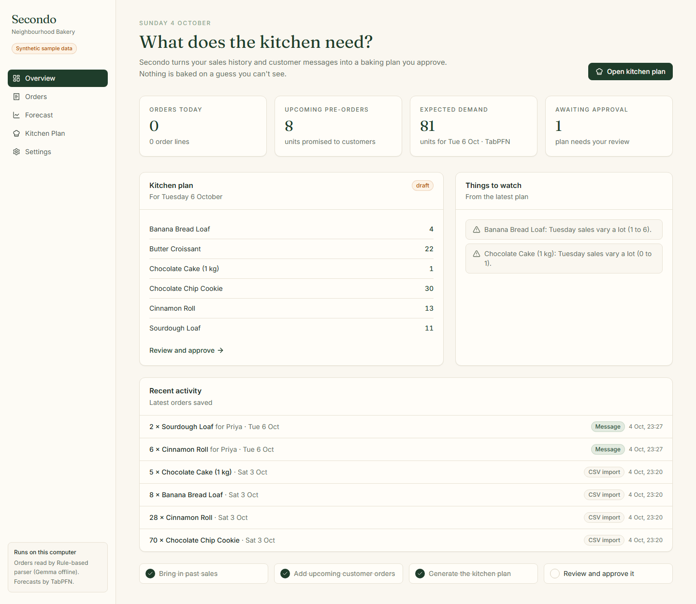
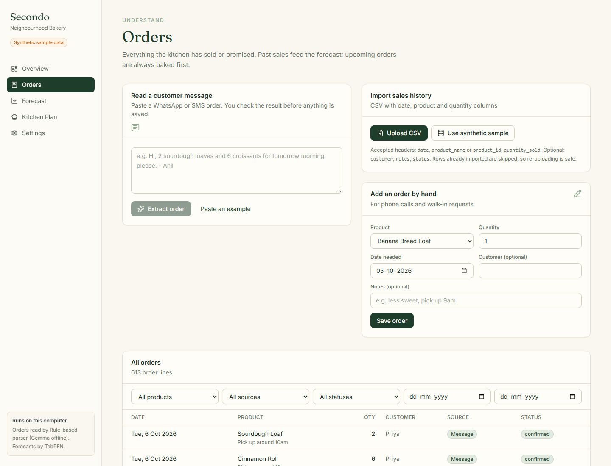
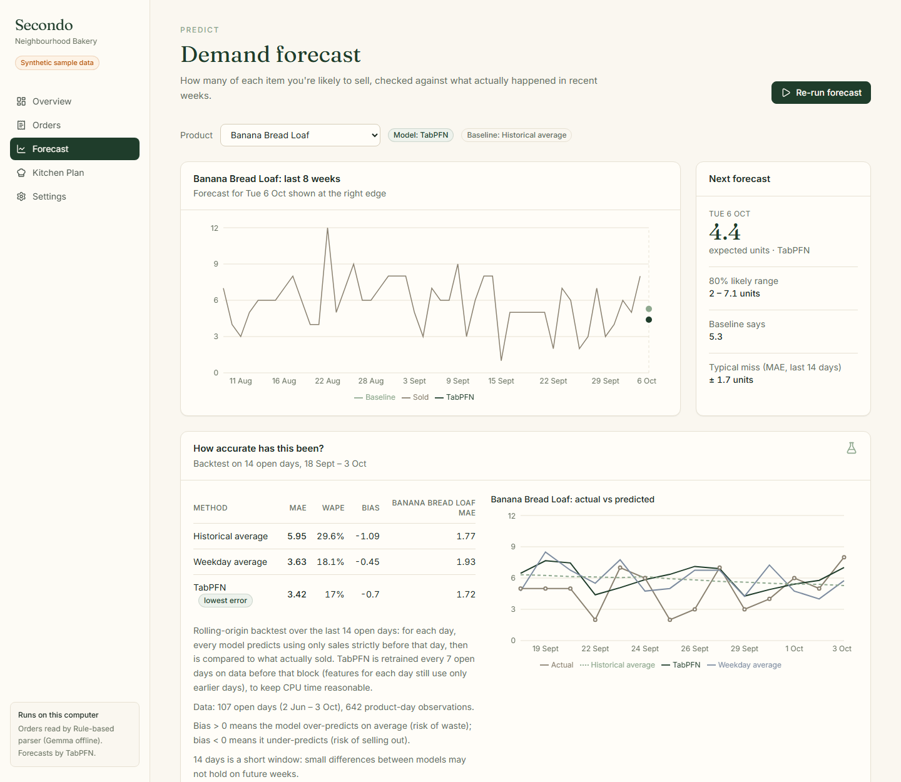
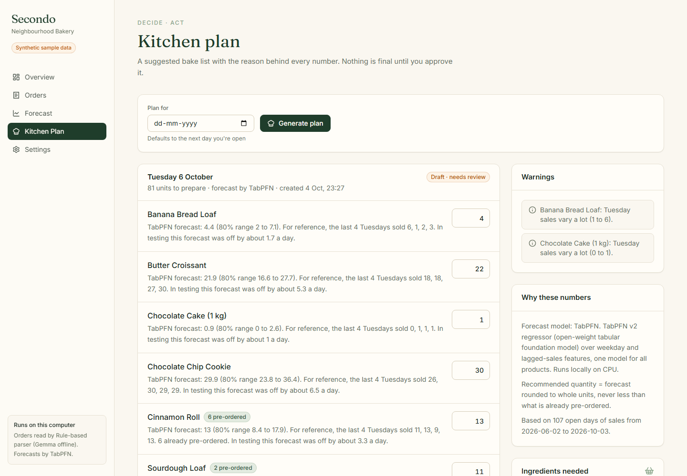
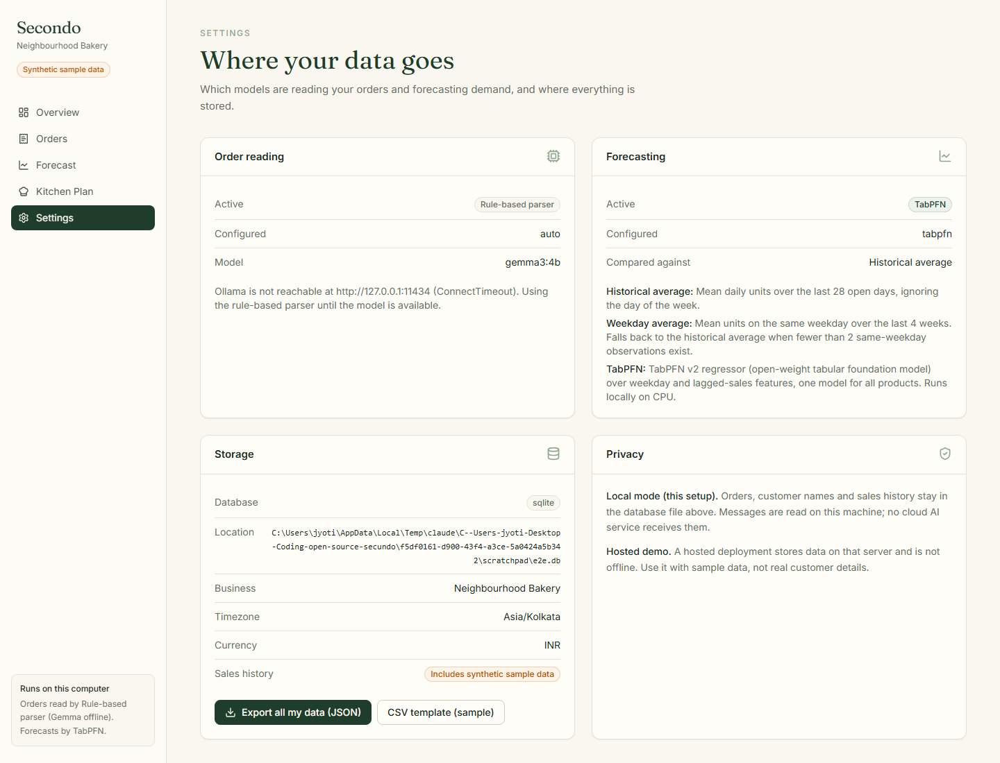

# SECONDO
**Your business. Your data. Your intelligence.**
SECONDO is a local-first operations copilot for small food businesses: home bakers, tiffin
services and other one- or two-person kitchens. It turns sales history and messy customer
messages into a daily baking plan that the owner reviews and approves. Every number in the plan
comes with the reason behind it.

It runs on the owner's own computer, with open-weight models and no API keys.

**Live demo (synthetic data, hosted on Render):** https://secondo-web.onrender.com. The free instance sleeps when idle, so the first load can take up to a minute. The hosted version uses the weekday average and the rule-based parser; TabPFN and Gemma run in the local setup.



> **About the data in this repository.** All sales data bundled here is **synthetic**: it was
> generated by `backend/scripts/generate_sample_data.py` with a fixed seed. The app shows a
> "Synthetic sample data" badge whenever it is loaded. No real business, customer or result is
> represented anywhere in this repo.

---

## The problem

A small home bakery usually runs on WhatsApp messages, a notebook and memory. Every evening the
baker has to answer the same question: *how much of each thing do I make tomorrow?*

- Customer orders arrive as free text ("2 sourdough and half a dozen cinnamon rolls for
  Saturday, eggless please – Priya") spread across chats.
- Walk-in demand has to be guessed. Guessing high wastes ingredients and unsold stock; guessing
  low means turning customers away.
- Enterprise forecasting tools are expensive, built for analysts, and want the business's data
  in someone else's cloud.

SECONDO aims to give that baker a better answer without asking them to become a data analyst or
hand over their customer list.

## What it does

| Stage | What happens |
|---|---|
| **Understand** | Import past sales from CSV (row-level validation, duplicate detection). Paste a customer message and Gemma, running locally, turns it into structured order lines. You check them before anything is saved. Manual entry for phone orders. |
| **Predict** | TabPFN forecasts tomorrow's demand per product. It is compared against a historical-average baseline and a weekday average in a leakage-free backtest, with MAE, WAPE and bias shown in the UI. |
| **Decide** | A kitchen plan: quantity per product, the reason for each number (forecast, 80% range, recent same-weekday sales, pre-orders), warnings, customer requests with dietary notes, and ingredient totals. |
| **Act** | The owner edits quantities, then approves or rejects. Approved plans are kept as an immutable record of what was predicted and what was actually decided. |

Nothing is decided automatically. The plan stays a draft until a person approves it.

## Screenshots

| Orders | Forecast |
|---|---|
|  |  |

| Kitchen plan | Settings |
|---|---|
|  |  |

## Architecture

A modular monolith: one FastAPI service and one Next.js app. There are no queues and no
microservices, because one bakery doesn't need them.

```
Browser ──► Next.js dashboard (:3000) ──/api/* rewrite──► FastAPI (:8000)
                                                            │
             ┌──────────────────────────────────────────────┤
             ▼                         ▼                    ▼
   Ingestion service         Extraction service     Demand service ──► Planning service
   CSV parse + validate      Gemma via Ollama       TabPFN (featured)    recommendations,
   duplicate detection       ↳ JSON-schema output   Weekday average      explanations,
   order normalisation       ↳ validate, retry      Historical average   warnings, ingredients,
             │               ↳ rules fallback       Backtest + cache     approve/reject/modify
             └──────────────────────┬───────────────────────┘                    │
                                    ▼                                            ▼
                          Repository (SQLite file) ◄─────────────── saved kitchen plans
```

- **Model output is never trusted blindly.** Gemma only *reads* the message. Catalogue
  matching, date resolution and confidence scoring are deterministic code shared with the
  rule-based parser, so the model cannot book a product that isn't on the menu.
- **Every optional component degrades visibly.** If Ollama isn't running, extraction falls back
  to the rule-based parser. If TabPFN isn't installed or fails, forecasting falls back to the
  weekday average. In both cases the API and UI say which path was used and why.
- **The browser only talks to Next.js.** `/api/*` is proxied to FastAPI, so the backend address
  never reaches client code and no CORS setup is needed.

Code map: `backend/app/services/` holds one module per stage (`ingestion`, `extraction`,
`gemma`, `forecasting`, `tabpfn_provider`, `demand`, `planning`). `backend/app/api/` holds the
routes. `frontend/src/app/` has one folder per screen.

## Tech stack

- **Backend:** Python 3.11, FastAPI, Pydantic, pandas, NumPy, SQLite, managed with [uv](https://docs.astral.sh/uv/)
- **AI:** Gemma 3 4B via [Ollama](https://ollama.com) for order extraction; [TabPFN](https://github.com/PriorLabs/TabPFN) v2 regressor for forecasting (CPU build of PyTorch)
- **Frontend:** Next.js 16 (App Router), TypeScript, Tailwind CSS 4, Recharts, Lucide icons

## Running it locally

Requirements: Python 3.11+, [uv](https://docs.astral.sh/uv/getting-started/installation/), Node.js 20+.

```bash
# 1. Backend
cd backend
uv sync --extra tabpfn          # or plain `uv sync` to skip TabPFN (~1 GB of PyTorch)
uv run uvicorn app.main:create_app --factory --port 8000

# 2. Frontend (second terminal)
cd frontend
npm install
npm run dev                     # http://localhost:3000
```

Open http://localhost:3000 and click **Load synthetic sample sales**.

The first TabPFN run downloads the v2 regressor weights from Hugging Face (no account needed)
into your user cache. A cold backtest then takes about 30 seconds on a laptop CPU. Results are
cached until the sales history changes.

### Optional: Gemma via Ollama

```bash
# Install Ollama from https://ollama.com, then:
ollama pull gemma3:4b
```

With `EXTRACTION_PROVIDER=auto` (the default) the backend detects Ollama on
`127.0.0.1:11434` and uses Gemma. Otherwise it uses the rule-based parser and labels the
result as a fallback. **Settings** shows which one is active.

### Configuration

Everything is optional; see `backend/.env.example` and `frontend/.env.example`.

| Variable | Default | Purpose |
|---|---|---|
| `SECONDO_DB_PATH` | `backend/data/secondo.db` | SQLite file holding all records |
| `MONGODB_URI` | unset | Store records in MongoDB Atlas instead (hosted demo). Percent-encode special characters in the password |
| `SECONDO_BUSINESS_NAME` / `_TIMEZONE` / `_CURRENCY` | Neighbourhood Bakery / Asia/Kolkata / INR | "Today" is computed in the business's timezone |
| `EXTRACTION_PROVIDER` | `auto` | `auto`, `ollama` or `rules` |
| `OLLAMA_URL`, `OLLAMA_MODEL`, `OLLAMA_TIMEOUT_S` | `http://127.0.0.1:11434`, `gemma3:4b`, `60` | Local model endpoint |
| `FORECAST_PROVIDER` | `tabpfn` | `tabpfn`, `weekday_average` or `historical_average` |
| `CORS_ORIGINS` | `http://localhost:3000` | Only needed if the browser calls FastAPI directly |
| `SENTRY_DSN`, `SENTRY_ENVIRONMENT`, `SENTRY_TRACES_SAMPLE_RATE` | unset, `local`, `1.0` | Sentry error monitoring and tracing; off without a DSN |
| `ELEVENLABS_API_KEY`, `ELEVENLABS_VOICE_ID`, `ELEVENLABS_MODEL_ID` | unset, `JBFqnCBsd6RMkjVDRZzb`, `eleven_multilingual_v2` | Voice briefing of approved plans. The key needs only Text to Speech access. Free accounts must use a default (premade) voice |
| `BACKEND_URL` (frontend) | `http://127.0.0.1:8000` | Where Next.js forwards `/api/*` |

### Tests and checks

```bash
cd backend && uv run pytest && uv run ruff check . && uv run ruff format --check .
cd frontend && npx tsc --noEmit && npx eslint . && npm run build
```

There are 54 backend tests. They cover CSV parsing and invalid rows, duplicate detection,
extraction (rules and Gemma via a mocked Ollama API: valid output, retry on malformed JSON,
schema violations, timeouts, missing model, and **fallback when Ollama isn't running**),
forecast baselines, metric calculations, leakage checks for TabPFN features and the block-refit
backtest, TabPFN fallback when missing or crashing, plan generation, approval state transitions,
and the API end to end. One test runs the real TabPFN model and skips if the extra isn't
installed.

## Hosted demo on Render

`render.yaml` is a Render Blueprint with two free web services in Singapore: `secondo-api`
(FastAPI) and `secondo-web` (Next.js).

**What the hosted demo runs.** Free instances have 512 MB RAM, which can't run PyTorch/TabPFN
or Gemma. The hosted API therefore forecasts with the **weekday average** and reads messages
with the **rule-based parser**; the UI shows which method is active. Data is stored in
**MongoDB Atlas** (free disks are wiped on restart). Errors and traces go to **Sentry**, and
approved plans can be read aloud with **ElevenLabs**. The open-weight models run in the local
setup above.

**Deploy:**
1. In Render: **New → Blueprint**, then pick this repository. Render reads `render.yaml`.
2. When prompted, enter the secrets:
   - `secondo-api`: `MONGODB_URI`, `SENTRY_DSN`, `ELEVENLABS_API_KEY`
   - `secondo-web`: `BACKEND_URL` = `https://secondo-api.onrender.com`
3. Wait for both deploys, then open the `secondo-web` URL and click **Load synthetic sample sales**.

**Notes:**
- If Render gives the API a different URL (e.g. with a suffix), set `BACKEND_URL` on
  `secondo-web` to it and redeploy. The URL is compiled in at build time.
- Atlas must allow connections from Render: *Network Access → 0.0.0.0/0* (free Render
  services have no fixed outbound IPs).
- Free services sleep when idle; the first request after a while takes up to a minute.
- The demo has **no login**. Anyone with the URL can add orders and approve plans, which can
  generate ElevenLabs audio. Use sample data only, and keep a credit limit on the ElevenLabs key.

## Forecast evaluation

**Method.** Rolling-origin backtest over the last 14 open days of history. For each day, every
model predicts using only sales from *before* that day, and the prediction is compared with what
actually sold. TabPFN is retrained once per 7-day block on data before the block; within a
block, each day's features (lags, same-weekday averages, rolling means) still use only earlier
days. This keeps CPU time reasonable without letting the model see the answer. Tests check both
properties.

**Results on the bundled synthetic data** (107 open days, 2 Jun – 3 Oct 2026; holdout
18 Sep – 3 Oct; 6 products; measured on an Intel Core i5-12500H laptop CPU):

| Method | MAE (units/product/day) | WAPE | Bias |
|---|---|---|---|
| Historical average, 28 days (baseline) | 5.95 | 29.6% | −1.09 |
| Weekday average, 4 weeks | 3.63 | 18.1% | −0.45 |
| **TabPFN v2** (4 estimators, CPU) | **3.42** | **17.0%** | −0.70 |

**How to read this honestly:**

- TabPFN beats the naive baseline clearly, and the weekday average only slightly (about 6% lower
  MAE). That is a small edge over 84 product-days and may not hold over other weeks.
- The synthetic data was *generated* from weekday multipliers plus noise, which is exactly the
  structure a weekday average captures. These numbers show the pipeline works and is leakage-free.
  They are **not** evidence of how TabPFN does on a real bakery's sales. That needs real data.
- Runtime on that CPU: about 25–30 s for a cold backtest (two TabPFN fits) and about 10 s for a
  single next-day forecast. Results are cached per sales-history fingerprint.

## Privacy and local-first

- In the local setup, orders, customer names and sales history live in one SQLite file on the
  owner's machine. Gemma runs through a local Ollama server, so customer messages are never sent
  to a cloud LLM.
- TabPFN runs locally on CPU. The only network access is the one-time download of model weights.
- If Sentry is enabled, events carry timings, model names, token counts and error messages, but never the message text or customer names, and `send_default_pii` is off. Tests never report to Sentry.
- If ElevenLabs is configured, approved plans can be read aloud. Only product quantities, dietary labels and warnings are sent to ElevenLabs.
- **Settings → Export all my data** downloads every stored record as JSON.
- Only what the plan needs is stored: a display name, dietary constraints and notes per
  customer, with no phone numbers.
- The hosted demo (see *Hosted demo on Render*) is *not* offline or private in the same way; use it with sample data only.

## Demo script (~90 seconds)

1. **Overview:** "A home baker decides every night how much to bake. Here's an empty SECONDO."
   Click **Load synthetic sample sales** (four months of clearly labelled synthetic history).
2. **Orders:** click **Paste an example**, then **Extract order**. Show the provider badge
   (Gemma via Ollama, or the labelled rules fallback), the confidence score and the resolved
   date. Adjust a field, then **Save order**.
3. **Forecast:** pick a product. Show sales history, tomorrow's TabPFN forecast with its 80%
   range, and the backtest table comparing TabPFN with the baseline using the measured numbers.
4. **Kitchen plan:** **Generate plan**. Read one explanation aloud: forecast, range, recent
   same-weekday sales and pre-orders. Edit a quantity, add a note, **Save & approve**.
5. **Voice briefing:** on the approved plan, click **Play briefing**.
6. **Settings:** show that everything runs on this machine and that the data can be exported.

## Sponsor technologies: actual status

| Technology | Status | Evidence |
|---|---|---|
| **Gemma** (via Ollama) | ✅ Implemented: JSON-schema structured output, Pydantic validation, retry, timeout, labelled fallback | `backend/app/services/gemma.py`, `tests/test_gemma.py`. **Note:** tested against a mocked Ollama API; Ollama was not installed on the development machine, so it has **not yet been run against live Gemma**. |
| **TabPFN** | ✅ Implemented and measured | `backend/app/services/tabpfn_provider.py`, results table above |
| **Render** | ✅ Deployed and verified | https://secondo-web.onrender.com (dashboard) and https://secondo-api.onrender.com (API), from `render.yaml` on the free plan. Verified live: health check through the dashboard proxy, data served from MongoDB Atlas, message reading, forecast backtest, ElevenLabs briefing (MP3 in 3.3 s), data export, and traces arriving in Sentry tagged `environment:render` with no errors. Screenshot: `docs/screenshots/render-live-settings.png`. |
| **MongoDB Atlas** | ✅ Implemented and verified against a real Atlas cluster | `backend/app/repository_mongo.py` implements the same `Repository` interface; used when `MONGODB_URI` is set, otherwise SQLite. Unique index on `(business_id, dedupe_key)` enforces duplicate detection in the database. `SECONDO_TEST_BACKEND=mongodb uv run pytest` runs the full suite against Atlas (56/56 passing). The app ran the full workflow on Atlas and the approved plan survived a backend restart. Screenshot: `docs/screenshots/settings-atlas.png`. |
| **Sentry** | ✅ Implemented and verified against a real Sentry project | Error monitoring + tracing (`backend/app/observability.py`), off unless `SENTRY_DSN` is set. Custom spans: `secondo.extract` → `gen_ai.request` (Gemma call: model, tokens, attempt), `secondo.plan.generate`, `secondo.forecast.backtest`, `secondo.model.tabpfn`. Gemma failures while Ollama is up and TabPFN crashes become issues. A real trace showed plan generation at 22.3 s, dominated by three ~7 s TabPFN runs. |
| **ElevenLabs** | ✅ Implemented and verified with a real API key | Approved plans get a **Play briefing** button (`backend/app/services/narration.py`). The backend calls ElevenLabs, so the key never reaches the browser. The text sent contains only quantities, dietary labels and warnings, never customer names or notes, and is shown on screen as a transcript. Audio is cached per plan. Verified: a 244-character briefing became about 23 s of MP3 in 8.7 s, and the cached replay took 0.05 s. Screenshot: `docs/screenshots/plan-briefing.png`. |

## Known limitations

- **Synthetic data only.** No real business has used SECONDO yet, so there is no real-world
  accuracy, waste reduction or user feedback to report.
- **Gemma path not yet run live** (see above).
- The bundled history ends on 3 Oct 2026. On a later date the plan warns that the history is
  stale.
- Promotions in the sample CSV are not imported or used as a forecast feature.
- Single business, single user, no authentication. It's meant for one owner's own machine.
- Voice-briefing audio is cached in memory, so after a restart a briefing is generated (and charged) again on first play.
- Closed days are inferred from the last 8 weeks of sales, not configured explicitly.
- Ingredient totals come from per-product recipes in `backend/app/seed.py`. There is no
  inventory tracking yet, so they are needs, not restock suggestions.

## Roadmap

1. Run with a real bakery's history and report real measured accuracy.
2. Verify the Gemma path end to end with live Ollama, and record extraction accuracy on a set of
   real (anonymised) messages.
3. A larger hosted instance (or separate model host) so the hosted demo can run TabPFN and Gemma too.
4. Inventory on hand, so restock suggestions can be made instead of just totals.

## Hacktoberfest: Build for a Friend

Built for the Hacktoberfest 2026 *Build for a Friend* challenge (#hf26challenge). The write-up
is in [`docs/dev-article.md`](docs/dev-article.md). Its "friend", Sidd, is a composite of small
café owners in Bangalore, and the article says so. It contains no invented feedback or results.
